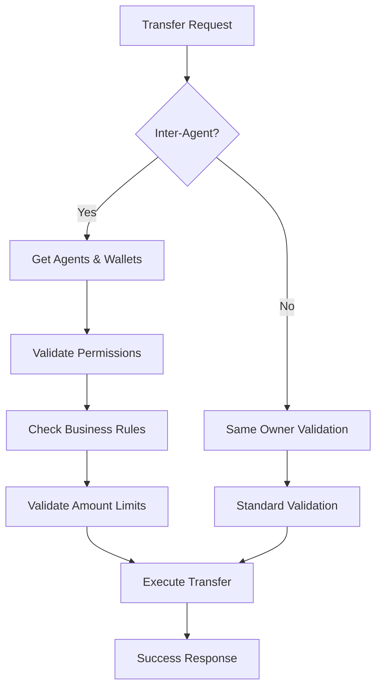

# Inter-Agent Transfer System Guide

## Overview

Your lottery system now supports **inter-agent transfers** between agents in the hierarchy with proper validation, business rules, and audit trails. This guide explains how to use the system effectively.

## 🏗️ System Architecture

### Agent Hierarchy

```
Company (Level 1)
├── Super Senior (Level 2)
    ├── Senior (Level 3)
        ├── Master (Level 4)
            ├── Agent (Level 5)
                └── Member (Level 6)
```

### Wallet Types per Agent

-   **Main Wallet**: Primary funds for betting and transactions
-   **Commission Wallet**: Commission earnings from downlines
-   **Bonus Wallet**: Bonus and promotional credits

### Transfer Rules Matrix

| From Wallet             | To Wallet | Same Agent      | Cross-Agent |
| ----------------------- | --------- | --------------- | ----------- |
| Main → Main             | ✅        | ✅ (with rules) |
| Main → Commission       | ✅        | ✅ (with rules) |
| Main → Bonus            | ✅        | ✅ (with rules) |
| Commission → Main       | ✅        | ✅ (with rules) |
| Commission → Commission | ✅        | ✅ (with rules) |
| Bonus → Main            | ✅        | ✅ (with rules) |

## 🔧 API Usage

### Basic Transfer (Same Agent)

```json
POST /api/transactions/transfer
{
  "from_wallet_id": 1,
  "to_wallet_id": 2,
  "amount": 100.00,
  "currency": "KHR",
  "description": "Internal wallet transfer"
}
```

### Inter-Agent Transfer

```json
POST /api/transactions/transfer
{
  "from_wallet_id": 1,
  "to_wallet_id": 5,
  "amount": 100.00,
  "currency": "KHR",
  "description": "Commission payment to downline",
  "initiator_agent_id": 123,
  "transfer_type": "commission",
  "metadata": {
    "reason": "monthly_commission",
    "period": "2024-01"
  }
}
```

### Transfer Types

#### 1. **Manual Transfer** (Default)

```json
{
    "transfer_type": "manual",
    "description": "Manual transfer between agents"
}
```

#### 2. **Commission Transfer**

```json
{
    "transfer_type": "commission",
    "description": "Commission payment from upline to downline"
}
```

#### 3. **Bonus Transfer**

```json
{
    "transfer_type": "bonus",
    "description": "Bonus credit to agent"
}
```

#### 4. **System Transfer**

```json
{
    "transfer_type": "system",
    "description": "System-initiated transfer"
}
```

## 📋 Business Rules

### 1. **Transfer Permissions**

#### Who can transfer to whom:

-   **To Upline**: ✅ (Commission payments, profit sharing)
-   **To Downline**: ✅ (Funding, bonuses)
-   **To Peers**: ✅ (Same upline only)
-   **Cross-hierarchy**: ❌ (Company level only)

#### Initiator Rules:

-   **Self-transfer**: Agent can transfer their own funds
-   **Management**: Upline can transfer funds between downlines
-   **Company level**: Can transfer between any agents

### 2. **Transfer Type Rules**

#### Commission Transfers:

-   Must originate from commission wallet
-   Only upline can initiate to downlines
-   Requires management permissions

#### Bonus Transfers:

-   Must go to main or bonus wallet
-   Only higher hierarchy can give bonuses
-   Requires management permissions

#### Manual Transfers:

-   Follow general hierarchy rules
-   Self-authorization or management required
-   Most flexible transfer type

### 3. **Amount Limits per Agent Type**

| Agent Type   | Max Transfer Amount |
| ------------ | ------------------- |
| Company      | $1,000,000          |
| Super Senior | $500,000            |
| Senior       | $100,000            |
| Master       | $50,000             |
| Agent        | $10,000             |
| Member       | $1,000              |

### 4. **Currency & Wallet Compatibility**

-   Both wallets must have same currency
-   Wallet types must be compatible (see transfer rules matrix)
-   Both wallets must be active

## 🔍 Transfer Validation Flow



## 📊 Real-world Examples

### Example 1: Commission Payment

```json
// Master (AAAAAA) pays commission to Agent (AAAAAAAA)
{
    "from_wallet_id": 10, // Master's commission wallet
    "to_wallet_id": 15, // Agent's main wallet
    "amount": 5000.0,
    "currency": "KHR",
    "description": "Monthly commission payment",
    "initiator_agent_id": 5, // Master's ID
    "transfer_type": "commission"
}
```

### Example 2: Funding Downline

```json
// Agent (AAAAAAAA) funds Member (AAAAAAAA001)
{
    "from_wallet_id": 15, // Agent's main wallet
    "to_wallet_id": 20, // Member's main wallet
    "amount": 1000.0,
    "currency": "KHR",
    "description": "Initial funding for new member",
    "initiator_agent_id": 8, // Agent's ID
    "transfer_type": "manual"
}
```

### Example 3: Bonus Distribution

```json
// Senior (AAAA) gives bonus to Master (AAAAAA)
{
    "from_wallet_id": 5, // Senior's main wallet
    "to_wallet_id": 12, // Master's bonus wallet
    "amount": 2000.0,
    "currency": "KHR",
    "description": "Performance bonus",
    "initiator_agent_id": 3, // Senior's ID
    "transfer_type": "bonus"
}
```

## 🛡️ Security Features

### 1. **Audit Trail**

Every transfer includes:

-   Initiator agent information
-   Transfer relationship type
-   Business rule validation results
-   Complete transaction metadata

### 2. **Permission Validation**

-   Hierarchy-based permissions
-   Transfer type restrictions
-   Amount limits per agent type
-   Currency compatibility checks

### 3. **Business Rules Enforcement**

-   Automatic validation of agent relationships
-   Transfer type specific rules
-   Wallet compatibility checks
-   Real-time permission verification

## 🚨 Error Handling

### Common Errors:

#### 1. **Insufficient Permissions**

```json
{
    "error": "Agent 'AAAAAAAA' is not authorized to transfer from 'BBBBBBBB' to 'CCCCCCCC'"
}
```

#### 2. **Transfer Not Allowed**

```json
{
    "error": "Manual transfer not allowed between these agents"
}
```

#### 3. **Amount Limit Exceeded**

```json
{
    "error": "Transfer amount 15000.00 exceeds maximum allowed 10000.00 for agent type 'agent'"
}
```

#### 4. **Currency Mismatch**

```json
{
    "error": "Currency mismatch: cannot transfer from USD to KHR"
}
```

## 🔄 Transaction Metadata

### Enhanced Transaction Records

```json
{
    "metadata": {
        "inter_agent_transfer": true,
        "from_agent_id": 123,
        "to_agent_id": 456,
        "initiator_agent_id": 789,
        "transfer_relationship": "upline_transfer",
        "business_transfer_type": "commission",
        "transfer_type": "outgoing",
        "counterpart_wallet_id": 456,
        "transfer_reference": "TRF_1234567890_123_456"
    }
}
```

## 🎯 Best Practices

### 1. **Always Specify Transfer Type**

```json
// Good
{
  "transfer_type": "commission",
  "description": "Monthly commission payment"
}

// Avoid
{
  "description": "Payment to agent"
}
```

### 2. **Include Meaningful Descriptions**

```json
// Good
{
  "description": "Q4 2024 performance bonus for exceeding targets"
}

// Avoid
{
  "description": "Transfer"
}
```

### 3. **Use Metadata for Audit**

```json
{
    "metadata": {
        "period": "2024-01",
        "reason": "monthly_commission",
        "performance_metrics": {
            "target": 100000,
            "achieved": 150000
        }
    }
}
```

### 4. **Validate Before Transfer**

```json
// Check agent relationships first
GET /api/agents/{agentId}/transfer-permissions?target_agent_id={targetId}

// Then perform transfer
POST /api/transactions/transfer
```

## 📈 Monitoring & Analytics

### Transfer Relationship Types

-   `upline_transfer`: To upline (commission payments)
-   `downline_transfer`: To downline (funding, bonuses)
-   `peer_transfer`: To peer (same upline)
-   `self_transfer`: Between own wallets
-   `cross_hierarchy_transfer`: Across hierarchies (company only)

### Audit Queries

```sql
-- Get all inter-agent transfers
SELECT * FROM wallet_transactions
WHERE JSON_EXTRACT(metadata, '$.inter_agent_transfer') = true;

-- Get commission transfers
SELECT * FROM wallet_transactions
WHERE JSON_EXTRACT(metadata, '$.business_transfer_type') = 'commission';

-- Get transfers by relationship
SELECT * FROM wallet_transactions
WHERE JSON_EXTRACT(metadata, '$.transfer_relationship') = 'upline_transfer';
```

## 🔮 Future Enhancements

### Planned Features:

1. **Automated Commission Calculations**
2. **Transfer Approval Workflows**
3. **Real-time Transfer Notifications**
4. **Advanced Reporting Dashboard**
5. **Transfer Scheduling**
6. **Multi-currency Transfers**

---

**✅ Your lottery system now supports secure, validated inter-agent transfers with complete audit trails and business rule enforcement!**
